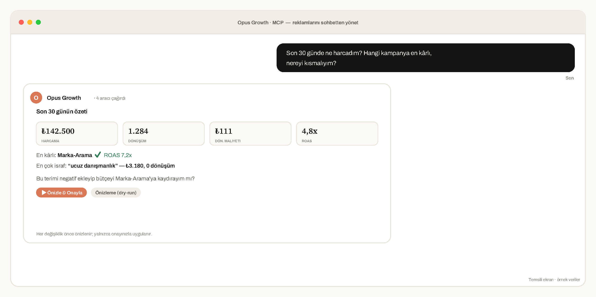
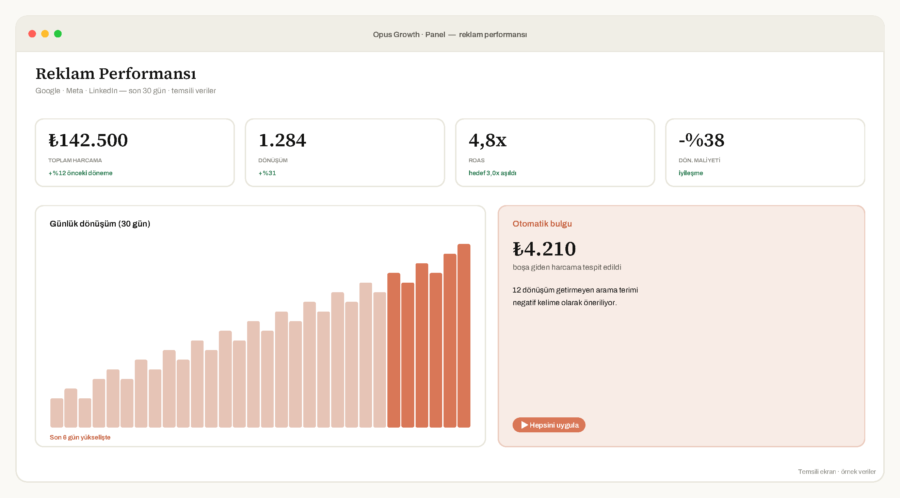

<picture>
  <source media="(prefers-color-scheme: dark)" srcset="assets/opus-logo-light.svg">
  
</picture>

<h3>The MCP Connector for Ad Platforms</h3>

<b>Manage Google, Meta, LinkedIn &amp; TikTok Ads straight from ChatGPT, Claude &amp; any MCP client.</b> 
Paste one URL. No terminal, no API keys, no developer token.

<a href="https://opus-growth.com"><b>opus-growth.com&nbsp;→</b></a>&nbsp;&nbsp;·&nbsp;&nbsp;7-day free trial, no card

  

---

## What is this?

**Opus Growth** is a **hosted [MCP](https://modelcontextprotocol.io) (Model Context Protocol) connector** that links your advertising accounts to AI assistants. Connect once, then manage everything in plain language:

> *“How much did I spend in the last 30 days, and which campaign is profitable?”*
> *“Find the search terms burning budget and add them as negatives.”*
> *“Increase the budget of my best-converting campaign by 20%.”*

The AI reads your reports, finds waste, and even builds campaigns — but **never changes anything without showing you a preview and asking for your confirmation first.**

## See it in action

 
<i>Representative screens with sample data.</i>

## Why teams use it

| Managing ads the old way | With Opus Growth |
| :-- | :-- |
| Log into 3–4 dashboards every day | Ask one question in your AI chat |
| Export to spreadsheets for reports | Instant, formatted reports |
| Hunt for wasted spend by hand | Waste flagged automatically |
| Risky bulk edits | Preview + one-tap confirm on every change |
| A terminal, API keys, a dev token | One URL, one login, ~5 minutes |

## How it works

1. **Copy** your connector URL from [opus-growth.com](https://opus-growth.com)
2. **Paste** it into ChatGPT / Claude → *Settings → Connectors (MCP)*
3. **Sign in** with the platform (official OAuth) — done in ~5 minutes

No code. No Google Cloud project. No developer token.

## Supported platforms

| Platform | Status | Tools |
| :-- | :-- | :-- |
| **Google Ads** | ✅ Live | 37 |
| **Meta** (Facebook / Instagram) Ads | ✅ Live | 27 |
| **LinkedIn Ads** | ✅ Live | 18 |
| **TikTok Ads** | 🔜 Coming soon | 25 |

Performance reports · account audits · search-term waste analysis · campaign creation (Search, Performance Max, Demand Gen, App) · bidding &amp; conversions · keyword research · audiences · budget reallocation — and more.

## Safety by design

- 🔒 **Preview + confirm** on every write — the AI can’t touch your account on its own
- 📉 **Budget guardrails** — every increase is capped per change
- 🧾 **Full audit log** of every change
- 🔑 **Official OAuth**, tokens encrypted at rest, revoke access anytime

See [`SECURITY.md`](SECURITY.md) for our full security posture and disclosure policy.

## Works with

**ChatGPT** · **Claude** · Claude Code · Cursor · Codex · any MCP-compatible client.

## Get started

### 👉 [opus-growth.com](https://opus-growth.com)

**7-day free trial — no card required.**

## FAQ

<b>Do I need to code?</b>

No. One URL and one login. No terminal, no API keys, no developer token.

<b>Is it safe to connect my account?</b>

Yes. Access is via official OAuth (we never see your password), tokens are encrypted, every change is preview-and-confirm, and you can revoke access anytime.

<b>Which AI assistants work?</b>

Any MCP client — ChatGPT connectors, Claude, Claude Code, Cursor, Codex and more.

<b>Türkçe destekliyor mu?</b>

Evet — arayüz ve destek tamamen Türkçe. <a href="https://opus-growth.com">Detaylar →</a>

---

ℹ️ Opus Growth is a <b>hosted service</b> — this repository is a project overview and intentionally contains no source code.

  
Made with ☕ in Türkiye&nbsp;·&nbsp;<a href="https://opus-growth.com">opus-growth.com</a>&nbsp;·&nbsp;<a href="https://opus-growth.com/yasal/gizlilik-kvkk">Privacy</a>&nbsp;·&nbsp;<a href="CHANGELOG.md">Changelog</a>

