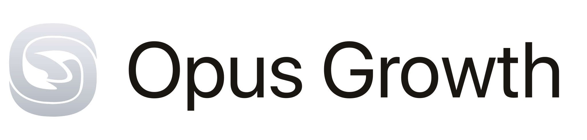
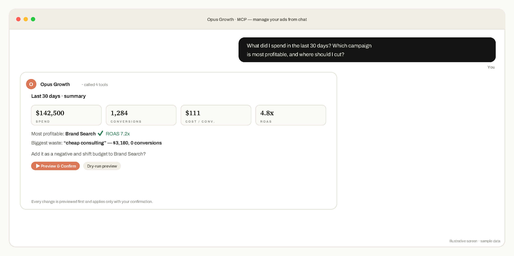
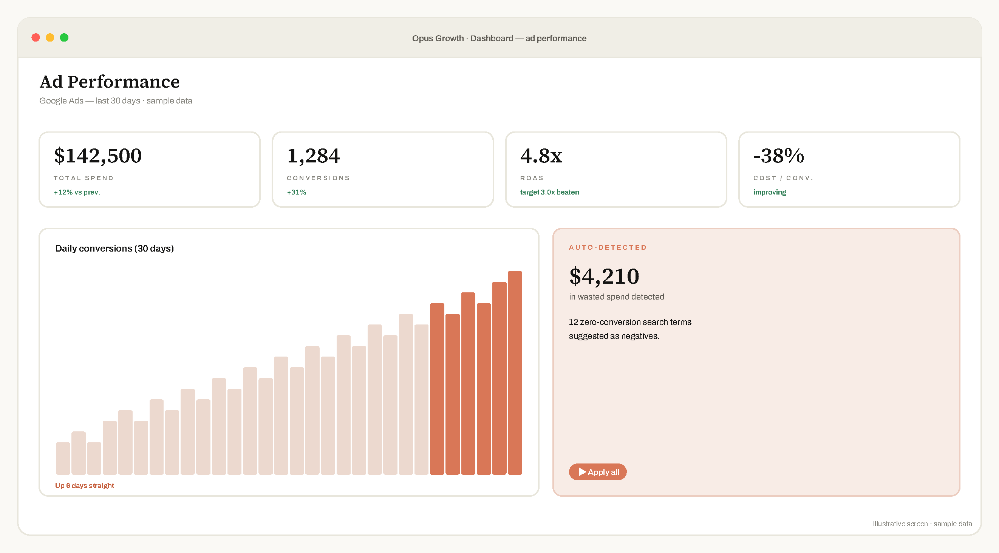
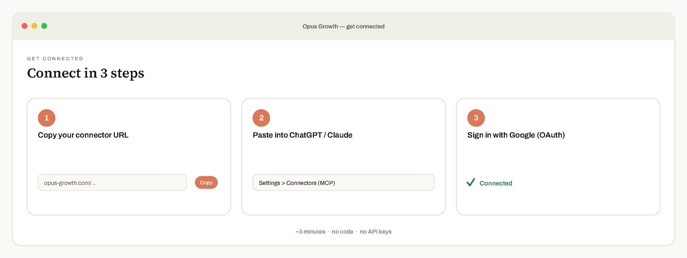

<div align="center">

<picture>
  <source media="(prefers-color-scheme: dark)" srcset="assets/opus-logo-light.svg">
  
</picture>

<h1>Manage Google, Microsoft, TikTok &amp; LinkedIn Ads from ChatGPT &amp; Claude — the MCP Connector for Ad Platforms</h1>

<p><b>Manage Google, Microsoft, TikTok &amp; LinkedIn Ads from ChatGPT, Claude &amp; any MCP client.</b><br/>
Paste one URL — no terminal, no API keys, no developer token.<br/>
<sub>233 tools · real write actions with preview &amp; approval · Meta Ads in final platform review.</sub></p>

<p>
<a href="https://opus-growth.com"></a>


</p>

<a href="https://opus-growth.com"><b>opus-growth.com&nbsp;→</b></a>&nbsp;&nbsp;·&nbsp;&nbsp;7-day free trial, no card

<sub><a href="#what-is-opus-growth">What</a> · <a href="#quickstart">Quickstart</a> · <a href="#how-do-i-connect-google-ads-to-chatgpt-or-claude">How it works</a> · <a href="#which-ad-platforms-does-opus-growth-support">Platforms</a> · <a href="#pricing">Pricing</a> · <a href="#is-it-safe-to-connect-my-ad-account">Security</a> · <a href="#faq">FAQ</a></sub>

<br/><br/>



</div>

---

## What is Opus Growth?

**Opus Growth is a hosted [MCP](https://modelcontextprotocol.io) (Model Context Protocol) connector that lets you manage Google Ads, Microsoft Advertising, TikTok Ads and LinkedIn Ads — plus Search Console, GA4, Tag Manager, Business Profile and YouTube — directly from ChatGPT, Claude and any MCP-compatible AI assistant.** Connect once, then manage everything in plain language:

> *“How much did I spend in the last 30 days, and which campaign is profitable?”*
> *“Find the search terms burning budget and add them as negatives.”*
> *“Increase the budget of my best-converting campaign by 20%.”*

> **In one line:** a hosted MCP connector that lets you manage four live ad platforms — Google Ads, Microsoft Advertising, TikTok Ads and LinkedIn Ads — from ChatGPT or Claude in plain language, with every change previewed before it runs. No code, no API keys.

The AI reads your reports, finds waste, and even builds campaigns — but **never changes anything without showing you a preview and asking for your confirmation first.**

## Manage Google Ads with AI — see it in action

<div align="center">

<br/><sub><i>Illustrative screen · sample data.</i></sub>
</div>

## Quickstart

**In ChatGPT or Claude:** open *Settings → Connectors (MCP) → Add*, paste your connector URL, then sign in with Google.

**In config-based clients (Cursor, Claude Code):**

```json
{
  "mcpServers": {
    "opus-growth": {
      "url": "https://mcp.opus-growth.com"
    }
  }
}
```

Your connector URL is **`https://mcp.opus-growth.com`** — setup takes about 60 seconds.

<div align="center">

</div>

## How do I connect Google Ads to ChatGPT or Claude?

1. **Copy** the connector URL: `https://mcp.opus-growth.com`
2. **Paste** it into ChatGPT / Claude → *Settings → Connectors (MCP)*
3. **Sign in** with Google (official OAuth) — done in about 60 seconds

No code. No Google Cloud project. No developer token.

## Which ad platforms does Opus Growth support?

| Platform | Status | Tools |
| :-- | :-- | :-- |
| **[Google Ads](https://opus-growth.com/en/google-ads-mcp/)** | ✅ Live | 78 |
| **[Microsoft Advertising](https://opus-growth.com/en/microsoft-ads-mcp/)** (Bing) | ✅ Live | 30 |
| **[TikTok Ads](https://opus-growth.com/en/tiktok-ads-mcp/)** | ✅ Live | 25 |
| **[LinkedIn Ads](https://opus-growth.com/en/linkedin-ads-mcp/)** | ✅ Live | 18 |
| **[Meta Ads](https://opus-growth.com/en/meta-ads-mcp/)** (Facebook / Instagram) | 🔜 In final platform review | 27 |

Connected Google data sources (live): **Search Console** 7 · **Analytics (GA4)** 11 · **Tag Manager** 17 · **Business Profile** 7 · **YouTube** 5.

**[→ Full tool catalog (all 233 tools)](TOOLS.md)**

### What can Opus Growth do with Google Ads?

- **Reporting** — spend, ROAS, conversions and cost-per-conversion across accounts
- **Account audits** — automated health checks that flag issues
- **Search-term waste analysis** — find zero-conversion terms and add them as negatives
- **Campaign creation** — Search, Performance Max, Demand Gen and App campaigns
- **Bidding &amp; conversions** — manage strategies and conversion actions
- **Keyword research** — keyword planner and keyword reports
- **Budget reallocation** — shift budget to your best-converting campaigns

78 Google Ads tools; 233 across every connected surface. Every write action is preview-and-confirm.

## Pricing

| Plan | Price | For |
| :-- | :-- | :-- |
| **Free trial** | $0 — 7 days, no card | Try every tool (50 AI actions) |
| **Pro** | **$49.99 / month** | Solo advertisers &amp; small teams (5,000 AI actions/mo) |
| **Agency** | **$99.99 / month** | Multi-account agencies — MCC / Business Center (unlimited) |

> Yearly: $499.99 / $999.99. Billed in USD via Lemon Squeezy (merchant of record). Start free at [opus-growth.com](https://opus-growth.com/en/pricing/) — no credit card for the trial.

## Why teams manage PPC with ChatGPT &amp; Claude

| Managing ads the old way | With Opus Growth |
| :-- | :-- |
| Log into the Google Ads UI + Editor + spreadsheets | Ask one question in your AI chat |
| Export to spreadsheets for reports | Instant, formatted reports |
| Hunt for wasted spend by hand | Waste flagged automatically |
| Risky bulk edits | Preview + one-tap confirm on every change |
| A terminal, API keys, a dev token | One URL, one login, ~60 seconds |

## How is this different from Google Ads Editor or an agency?

- **vs. the Google Ads UI / Editor** — No dashboards to learn. You ask in plain language and get an answer or an action; the AI writes the query, you approve the change.
- **vs. building your own API integration** — No Google Cloud project, no developer token, no OAuth code. Opus Growth is a hosted connector — paste one URL.
- **vs. a marketing agency or freelancer** — Instant answers 24/7 from $49.99/month, and you keep full control — every change is preview-and-confirm.

### Built for agencies

Manage multiple client accounts (Google MCC — and soon Meta Business Center) from one AI chat. The **Agency plan ($99.99/mo)** adds multi-account switching and unlimited AI actions.

## Is it safe to connect my ad account?

- 🔒 **Preview + confirm** on every write — the AI can’t touch your account on its own
- 📉 **Budget guardrails** — every increase is capped per change
- 🧾 **Full audit log** of every change
- 🔑 **Official OAuth**, tokens encrypted at rest, revoke access anytime

See [`SECURITY.md`](SECURITY.md) for our full security posture and disclosure policy.

## Works with ChatGPT, Claude &amp; any MCP client

**ChatGPT** · **Claude** · Claude Code · Cursor · Codex · and any MCP-compatible client.

## Roadmap

- **Meta (Facebook/Instagram) Ads** — built and complete, in final platform review, opening soon
- Deeper cross-platform budget optimization across all four live networks
- Scheduled reports &amp; alerts delivered to email/Slack
- Deeper cross-platform budget optimization

## Get started — connect your ad accounts in 5 minutes

<div align="center">

### 👉 [opus-growth.com](https://opus-growth.com)

**7-day free trial — no card required.**

</div>

## FAQ

### Do I need to code?
No. One URL and one login. No terminal, no API keys, no developer token.

### How do I connect Google Ads to ChatGPT?
Copy your connector URL from [opus-growth.com](https://opus-growth.com), open ChatGPT → *Settings → Connectors (MCP) → Add*, paste the URL, and sign in with Google. It takes about 5 minutes.

### Is it safe to connect my account?
Yes. Access is via official OAuth (we never see your password), tokens are encrypted at rest, every change is preview-and-confirm, and you can revoke access anytime.

### Which AI assistants work?
Any MCP client — ChatGPT connectors, Claude, Claude Code, Cursor, Codex and more.

### How much does it cost?
A 7-day free trial (no card), then **Pro $49.99/month** or **Agency $99.99/month** for multi-account teams. See [Pricing](#pricing).

### Does it support Turkish? / Türkçe destekliyor mu?
Yes — the interface and support are fully available in Turkish. Evet, arayüz ve destek tamamen Türkçe. [Details / Detaylar →](https://opus-growth.com)

---

<div align="center">
<sub>ℹ️ Opus Growth is a <b>hosted service</b> — this repository is the public project home (manifests, tool catalog, docs) and intentionally contains no source code.</sub>

<br/><br/>
<sub>
<a href="https://opus-growth.com/en/google-ads-mcp/">Google Ads MCP</a> ·
<a href="https://opus-growth.com/en/microsoft-ads-mcp/">Microsoft Ads MCP</a> ·
<a href="https://opus-growth.com/en/tiktok-ads-mcp/">TikTok Ads MCP</a> ·
<a href="https://opus-growth.com/en/linkedin-ads-mcp/">LinkedIn Ads MCP</a> ·
<a href="https://opus-growth.com/en/meta-ads-mcp/">Meta Ads MCP</a> ·
<a href="https://opus-growth.com/en/best-mcp-for-ads/">Best MCP for ads</a> ·
<a href="https://opus-growth.com/en/windsor-ai-alternative/">Windsor.ai alternative</a>
</sub>

<br/><br/>
Made with ☕ in Türkiye&nbsp;·&nbsp;<a href="https://opus-growth.com">opus-growth.com</a>&nbsp;·&nbsp;<a href="https://opus-growth.com/yasal/gizlilik-kvkk">Privacy</a>&nbsp;·&nbsp;<a href="SECURITY.md">Security</a>&nbsp;·&nbsp;<a href="CHANGELOG.md">Changelog</a>
</div>
